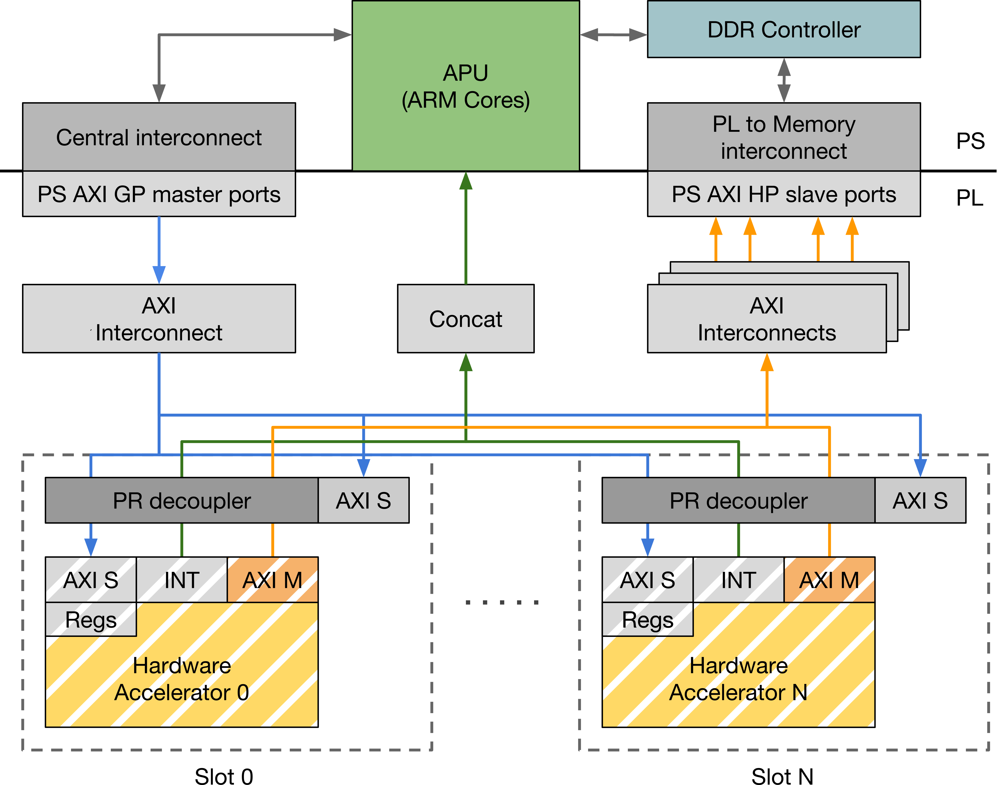
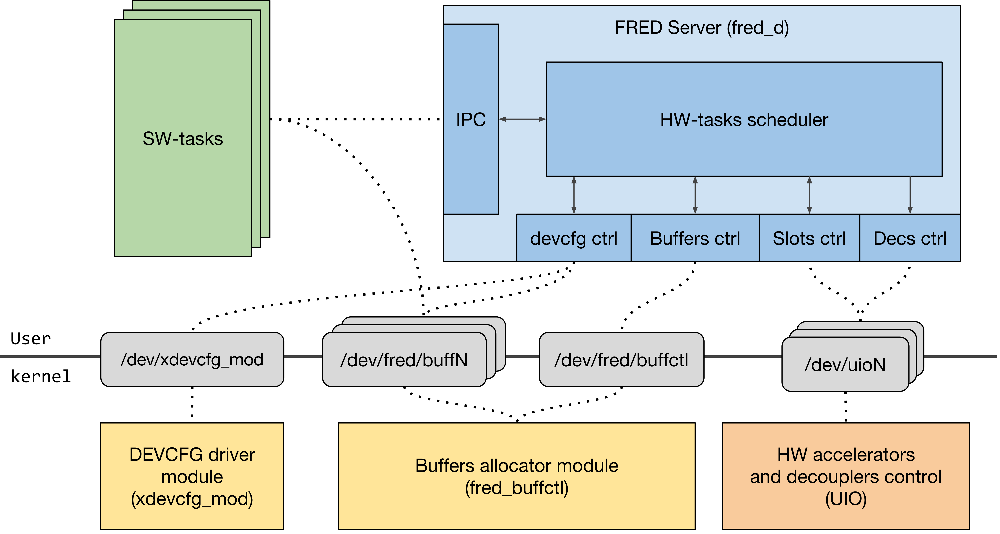
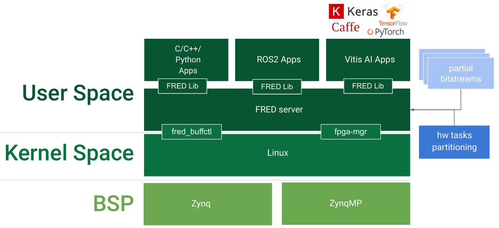

.. _runtime:

==============
FRED Runtime
==============

The *FRED runtime* is the reference implementation of the FRED framework for the GNU/Linux operating system. It has been designed to run on the *Xilinx Zynq-7000 and Zynq UltraScale+ SoC FPGAs platforms*. The FRED runtime consists of a *system support design*, automated by `Getting Started <../02_dart>`_, and a set of *software support* components.

System support design
----------------------

The :ref:`fred_hw_support_fig` is a reference design for the FPGA side of the SoC that has been designed to support the deployment of dynamically-reconfigured hardware accelerators. The support design divides the FPGA into two regions: a *static region* and a *reconfigurable region*. The static region contains the logic needed to realize the communication infrastructure, namely a set of AXI Interconnects, which can be extended by the user by adding other support modules depending on the specific needs. The reconfigurable region is organized into a set of statically defined slots that are logically grouped into partitions.

.. _fred_hw_support_fig:

    FRED support design

Software support
-----------------

The :ref:`fred_sw_support_fig` comprises a set of software components in charge of managing the FPGA and implementing the FRED scheduling policy on top of the system support design. The software support has been designed in a modular fashion, relying as much as possible on user space implementation to improve maintainability, safety, and expandability. The central component of the software support is a user-space server process, named the *FRED server*, which is in charge of managing acceleration requests from Linux processes (and threads) according to the FRED scheduling policy. Linux processes and hardware accelerators share data through a zero-copy mechanism implemented using physically contiguous (uncached) memory buffers. The FRED server relies on two custom kernel modules and the `UIO framework <https://www.kernel.org/doc/html/latest/driver-api/uio-howto.html>`_ for controlling the hardware accelerators.

.. _fred_sw_support_fig:

    FRED software support

The :ref:`fred_sw_stack_fig` figure introduces FRED runtime components. At the **application level** we see that it possible to write applications with `C/C++/Python programming languages <https://github.com/fred-framework/fred-tutorial-app>`_. It is also possible to write applications using ROS2 and Xilinx Vitis AI frameworks (*both currently under development*). Still in **user space**, we have the `fred_lib <https://github.com/fred-framework/fred-linux-client-lib>`_ which is linked with the application to have access to the `fred_server <https://github.com/fred-framework/fred-linux>`_.  

.. comments 
    this image source can be found in this link 
    https://docs.google.com/presentation/d/10wZZSQadBjDf3sg9Mvy9TM_6Sgrb7MYRacJHg6nL2AY/edit?usp=sharing

.. _fred_sw_stack_fig:

    FRED software stack

The FRED server initiates the FPGA support during the initialization phase and then manages requests coming from Linux processes and threads. Internally, the FRED server uses I/O multiplexing to monitor all hardware and software component events from a single event loop. The FRED server communicates with the software processes through a Unix domain socket using a simple messaging protocol. From a user perspective, the interactions between the software process and the FRED server are abstracted by `fred_lib <https://github.com/fred-framework/fred-linux-client-lib>`_, which is available in C and `Python <https://github.com/marco-pag/fred-linux-test-client/issues/1>`_.

In kernel space, two Linux kernel modules, called `fred_buffctl <https://github.com/fred-framework/fred-kmods/tree/fpga-mgr/fred_buffctl>`_ and `fpga_mgr <https://github.com/fred-framework/fred-kmods/tree/fpga-mgr/fpga_mgr_zynqmp_drv>`_, where developed/modified to abstract the access to the FPGA fabric.
The `fred_buffctl` module is used to allocate the contiguous memory buffers used to share data between software processes and dynamically-reconfigured hardware accelerators. The  `fpga_mgr` module manages the device reconfiguration in an optimized way with respect to the Xilin`s stock driver.

Three auxiliar repositories were develop to ease the FRED runtime deployment:

- `fred-framework <https://github.com/fred-framework/fred-framework>`_: a meta repository that combines all the software parts presented above, facilitating compilation in the board;
- `meta-fred <https://github.com/fred-framework/meta-fred>`_: A Yocto layer to facilitate cross-compilation and integration with a Linux image;
- `meta-retis <https://github.com/fred-framework/meta-retis>`_: A pre-configured Yocto image running on top of Xilinx petalinux that includes several resources for embedded software development for soft realtime applications. This image can be combined with *meta-fred* to generate a complete FRED-enabled Linux image for both **Zynq** and **ZynqMP** FPGA boards.

Testing FRED runtime
---------------------

FRED runtime is available for download. Further instructions can be found in `FRED repository <https://github.com/fred-framework/fred-linux>`_ and in the `Getting Started <../07_getting-started>`_ section.

Reference
-----------

  - M. Pagani, A. Balsini, A. Biondi, M. Marinoni, and G. Buttazzo, `A Linux-based Support for Developing Real-Time Applications on Heterogeneous Platforms with Dynamic FPGA Reconfiguration <http://retis.sssup.it/~a.biondi/papers/FRED_Linux_SOCC17.pdf>`_, Proc. of the 30th IEEE Int. System-on-Chip Conference (SOCC 2017), Munich, Germany, September 5-8, 2017.
