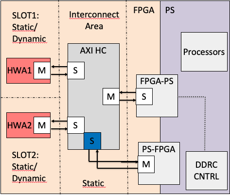
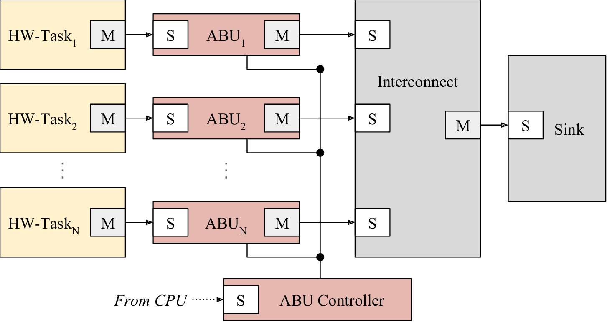
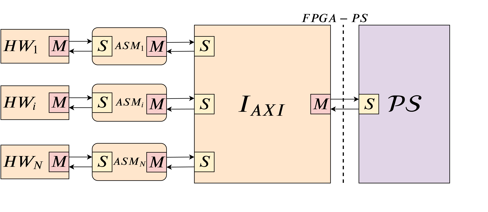
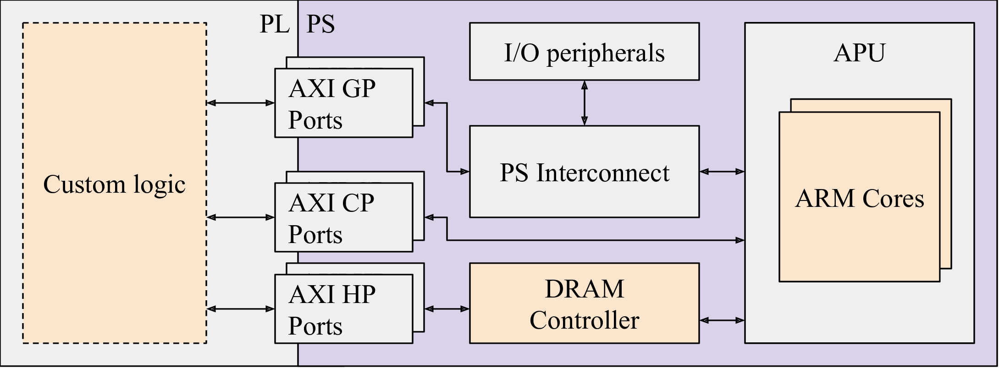
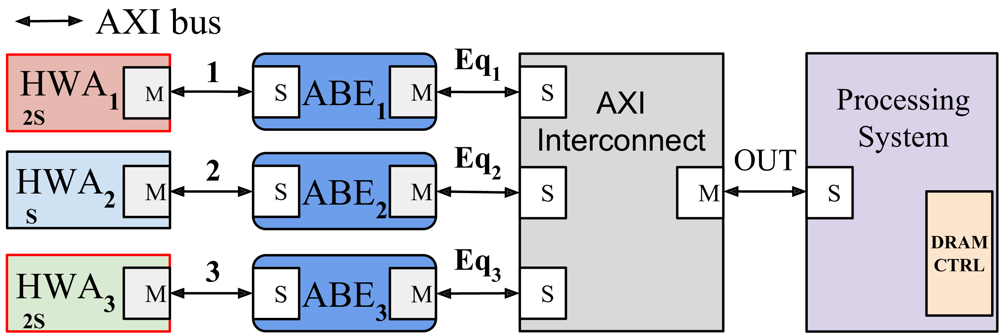

.. _busmanag:

============
Bus Manager
============

This section presents the current development related to the `bus manager`. Currently, `bus manager` is still `not integrated into DART <https://github.com/fred-framework/dart/issues/1>`_. Section :ref:`fred_hw_support_sec` explains the current DART bus architecture.
The rest of this chapter explains the *future* (i.e. to be integrated) FRED framework bus infrastructure, which consists of the following blocks.

AXI HyperConnect
------------------

Many Cyber-Physical systems are safety-critical and must undertake a certification process, at least for their critical subsystems. A key requirement for certifying safety-critical systems is timing predictability. This is particularly challenging for FPGA SoC, especially when considering that the hardware accelerators can experience bus/memory contention that can severely affect their timing performance. Furthermore, isolation capabilities are required to avoid propagating faults across subsystems and to bound contention delays generated by low-criticality untrusted subsystems.

Virtualization via hypervisor technologies is an established industrial practice for the co-existence of subsystems with mixed-criticality on the same platform while enforcing isolation. However, new challenges arise when virtualization is applied to FPGA SoC. Indeed, isolation must not only be ensured for software components running on the processors (as done by most hypervisors) but also for hardware accelerators (HAs) belonging to different subsystems that are jointly deployed on the same FPGA fabric. Furthermore, bus arbitration and the corresponding latency must be known and predictable.

The :ref:`axi_bus_fig` is a hypervisor-level AXI interconnect thought for COTS FPGA SoC, which allows interconnecting multiple hardware accelerators to the same bus while ensuring isolation and predictability. The AXI HyperConnect has been integrated within a type-1 hypervisor under development in our laboratory.

The main features introduced by the AXI HyperConnect are:

- **Openness.** The proposed hardware architecture for AXI HyperConnect is slim and open, making it prone to low-level inspection to extract worst-case timing bounds, as well as to the corresponding validation. Furthermore, the AXI HyperConnect comes with an open-source driver to control it.

- **Low latency and resource consumption.** AXI HyperConnect improves the propagation latency with respect to the state-of-the-art AXI interconnects while maintaining a comparable throughput. Its development in HDL language also allows obtaining low resource consumption on the FPGA fabric with respect to the state-of-the-art AXI interconnects.

- **Bandwidth reservation.** AXI HyperConnect implements a bandwidth reservation mechanism, which works by limiting the number of transactions to a given budget within periodic time windows. This mechanism can be configured by the hypervisor or the Operative System, allowing to reserve a given bus bandwidth to each hardware accelerators and also controlling the overall memory traffic coming from the FPGA fabric directed to the shared memory subsystem (which can delay the execution of software running on the processors of the PS).

- **Fair bandwidth distribution.** AXI HyperConnect implements a mechanism to equalize bus transactions to a nominal burst size and liming the number of outstanding transactions. Combined with bandwidth reservation, this mechanism guarantees a very predictable bus access as both the number of transactions.

- **Runtime reconfiguration.** AXI HyperConnect exports a control AXI slave interface that allows changing its configuration from the PS as a standard memory-mapped device. In the considered framework, this control interface is managed by the hypervisor. This feature allows dynamic reconfiguration of AXI HyperConnect under Dynamic Partial Reconfiguration.

- **Decoupling from the memory subsystem.** AXI HyperConnect allows to individually enable/disable at runtime the access to the memory subsystem for each hardware accelerator connected to its slave ports. This feature allows isolating misbehaving/malicious hardware accelerators (even due to faulty silicon) detected in the system. AXI HyperConnect decouples all the signals of a disabled slave port, which is a useful feature under dynamic partial reconfiguration.

- **Compatibility.** All the features offered by the AXI HyperConnect have been developed to be compliant with the AXI standard. This means that the AXI HyperConnect is completely transparent to both the hardware accelerators and the memory subsystem and can hence be installed in place of state-of-the-art interconnects without any extra effort. Furthermore, the AXI HyperConnect is compatible with both AXI3 and AXI4 devices.

.. _axi_bus_fig:

    AXI HyperConnect

**Reference**:

  - Francesco Restuccia, Alessandro Biondi, Mauro Marinoni, Giorgiomaria Cicero, and Giorgio Buttazzo, `AXI HyperConnect: A Predictable, Hypervisor-level AXI Interconnect for Hardware Accelerators in FPGA SoC <https://retis.sssup.it/~a.biondi/papers/DAC20_Hyperconnect.pdf>`_, In Proceedings of the 57th ACM/ESDA/IEEE Design Automation Conference (DAC 2020), San Francisco, CA, USA, July 19-23, 2020.

AXI Budgeting Unit
-------------------

The FRED framework includes the :ref:`abu_fig` a hardware-based reservation mechanism for the AMBA BUS aimed at controlling the contention incurred by hardware accelerators in the BUS bandwidth domain. The ABU provides bus bandwidth reservation for hardware accelerators deployed on the FPGA. The ABU infrastructure comprises a set of ABU modules controlled by a central unit named ABU controller. Each ABU module is meant to be placed between a hardware accelerator and the remainder of the bus infrastructure. The ABU module supervises the bus traffic generated by the corresponding hardware accelerator providing both temporal and spatial isolation effectively shielding the accelerator from possible misbehaviors of other accelerators. The bandwidth reservation is implemented with a budgeting mechanism, i.e., by enforcing a limit on the number of transaction that the hardware accelerator can perform in a predetermined period.

.. _abu_fig:

    AXI Budgeting Unit (ABU)

**Reference**:

  - M. Pagani, E. Rossi, A. Biondi, M. Marinoni, and G. Buttazzo, `A Bandwidth Reservation Mechanism for AXI-based Hardware Accelerators on FPGAs <https://retis.sssup.it/~a.biondi/papers/ECRTS19.pdf>`_, Proc. of the Euromicro Conference on Real-Time Systems (ECRTS 2019), Stuttgart, Germany, July 9-12, 2019.

AXI Stall Monitor (ASM)
------------------------

A big problem in using FPGA SoC platforms in safety-critical applications is that the interference occurring in accessing shared resources (such as the memory subsystem) may introduce unbounded and unpredictable delays in the computational activities, preventing any form of a-priori timing guarantee, required in such systems for certification purposes.

In modern FPGA SoC platforms data exchange mostly occurs through the AMBA AXI open standard. The AXI standard provides advanced features that make it highly flexible for different applications, but it does not define any mechanism to supervise the behaviour of bus masters. The lack of supervision allows hardware accelerators to behave (or misbehave) in the system without any control.

This is especially critical when hardware accelerators are provided as specialized IP blocks developed from external sources so that it is not possible to accurately validate them to verify the absence of misbehavior. To further complicate this issue, in systems using dynamic partial reconfiguration (DPR), misbehaving/malicious hardware accelerators can more likely be programmed on the FPGA. Such misbehaving conditions can compromise the functionality of the entire system, up to requiring a system reset to restore a safe condition. This leads to large recovery delays that may not be acceptable in safety-critical applications and can harm the quality of service in non-critical systems.

The :ref:`axi_stall_fig` is a component conceived to address this issue. The ASM is a minimal hardware module IP which shields the system from misbehaving HW-tasks that may stall the bus. A sample architecture comprising the ASM is reported in Figure 1. The configuration of the ASM is supported by a worst-case analysis to bound the worst-case response time of periodic hardware tasks sharing a common memory.

Leveraging the worst-case analysis, ASM leaves some flexibility in the behaviour of the hardware accelerators, while keeping the HW-task set schedulable even in the presence of one or multiple misbehaving hardware accelerators. ASM does not introduce any additional latency on the performance and has a minimal impact on resource consumption.

.. _axi_stall_fig:

    AXI Stall Monitor

**Reference**:

  - Francesco Restuccia, Alessandro Biondi, Mauro Marinoni, and Giorgio Buttazzo, `Safely Preventing Unbounded Delays During Bus Transactions in FPGA-based SoC <https://retis.sssup.it/~a.biondi/papers/FCCM2020.pdf>`_, the 28th IEEE International Symposium On Field-Programmable Custom Computing Machines (FCCM 2020), Fayetteville, Arkansas, USA, May 3-6, 2020.

AXI Bandwidth Equalizer
-------------------------

A typical FPGA SoC architecture combines a processing system (PS) (generally based on one or more processors) with a Field Programmable Gate Array (FPGA) subsystem in a single device. Both subsystems access a DRAM controller in the PS for accessing a shared DRAM memory.

The next figure illustrates :ref:`typical_fpga_arch` in which two interfaces allow the communication between the FPGA subsystem and the PS through a limited set of ports. The de-facto standard interface for interconnections is the ARM Advanced Microcontroller Bus Architecture Advanced eXtensible Interface (AMBA AXI).

.. _typical_fpga_arch:

    A typical SoC FPGA architecture

Whenever multiple AXI masters in the FPGA want to access the same output port, an AXI Interconnect is in charge of arbitrating conflicting requests. The AXI protocol does not specify how conflicting transactions are arbitrated and hence the design of bus arbiters is left to the vendors that adopt AXI. For instance, the AXI arbiters for FPGA SoCs by Xilinx implement round-robin. Round-robin arbitration should guarantee fairness in contending the bus; specifically, it should guarantee a fair distribution of the bus bandwidth among the masters that contend a port.

However, a completely unfair bandwidth distribution can be achieved under some configurations, like in the presence of transactions with heterogeneous burst sizes issued by the masters. This issue makes possible to arbitrarily decrease the bus bandwidth of a target master node.

The :ref:`abe_fig` developed in this framework restores fairness in the bus arbitration. The ABE is conceived to be placed between each hardware accelerator and an input port of an AXI Interconnect with the purpose of equalizing the address burst requests issued by the AXI master hardware accelerators.

.. _abe_fig:

    AXI Bus Equalizer (ABE)

The main objective of the ABE is to achieve a fair bus bandwidth allocation in the presence of round-robin arbitration. ABE is implemented in HDL language, hence it is highly optimized in terms of performance, parallelism, and area consumption. Latency introduced by ABE on a single transaction is just one clock cycle, independently of the burst size of the transactions. The ABE is provided as a Xilinx IP block to simplify its integration in realistic designs. The impact of ABEs on resource consumption is very marginal (less than the 0.5% on a Zynq Ultrascale and about
4% in a ZYNQ Z-7020).

**Reference**:

  - Francesco Restuccia, Marco Pagani, Alessandro Biondi, Mauro Marinoni, and Giorgio Buttazzo, `Is Your Bus Arbiter Really Fair? Restoring Fairness in AXI Interconnects for FPGA SoCs <https://retis.sssup.it/~a.biondi/papers/CASES19.pdf>`_, ACM Transactions on Embedded Computing Systems, to appear. Presented at the International Conference on Compilers, Architectures, and Synthesis for Embedded Systems (CASES 2019), New York, USA, October 13 - 18, 2019.

