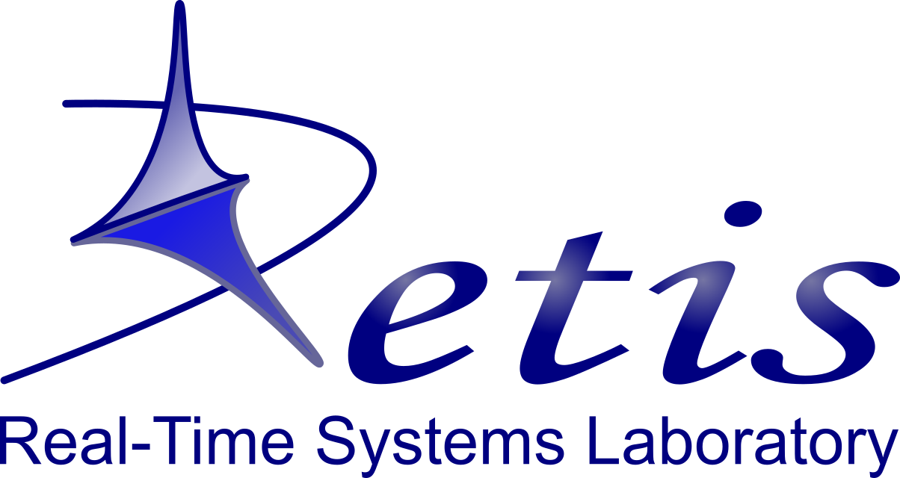

.. _about:

======
About 
======

The FRED framework has been developed at the `RETIS Lab <https://retis.santannapisa.it/>`_ of the `Scuola Superiore Sant’Anna <https://www.santannapisa.it/en>`_ of Pisa.

Project coordinators:

-   `Giorgio Buttazzo <http://retis.sssup.it/~giorgio/>`_
-   `Alessandro Biondi <https://retis.sssup.it/~a.biondi/>`_
-   `Mauro Marinoni <http://retis.sssup.it/~nino/>`_

Contributors:

-  Alessandro Biondi: FRED Analyzer, AXI Budgeting Unit, AXI Bandwidth Equalizer, Floorplannig;
-  Alessio Balsini: FRED scheduling simulator, FRED runtime;
-  Alexandre Amory: FRED/DART integration, DART testing, FRED build system, documentation, testing on ZCU102 board;
-  Biruk Seyoum: DART and Floorplannig;
-  Enrico Rossi: Preemptable reconfiguration, AXI Budgeting Unit;
-  Francesco Restuccia: AXI Bandwidth Equalizer, AXI Stall Monitor, AXI HyperConnect, Xilinx DNN;
-  Giuseppe Lipari: AXI Budgeting Unit;
-  Lorenzo Molinari: Support for PYNQ;
-  Marco Pagani: FRED runtime, AXI Budgeting Unit, AXI Bandwidth Equalizer, Image processing demo;
-  Sara Balleri: Deep learning case study.

