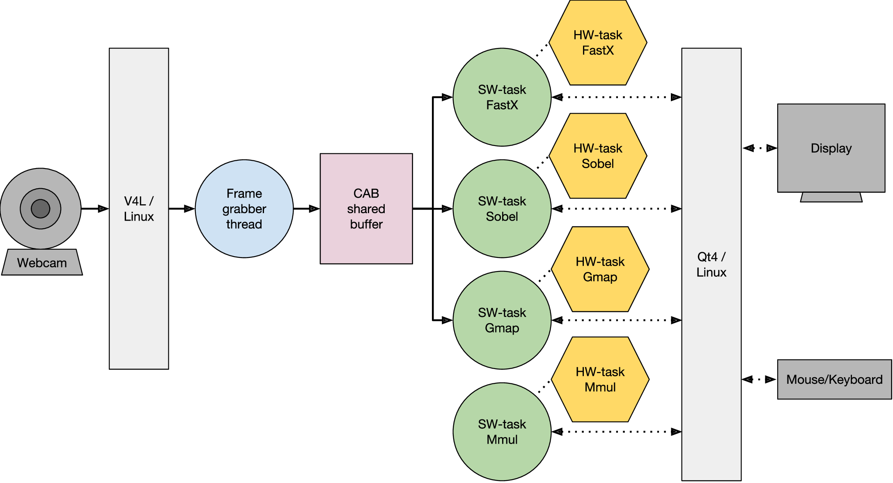
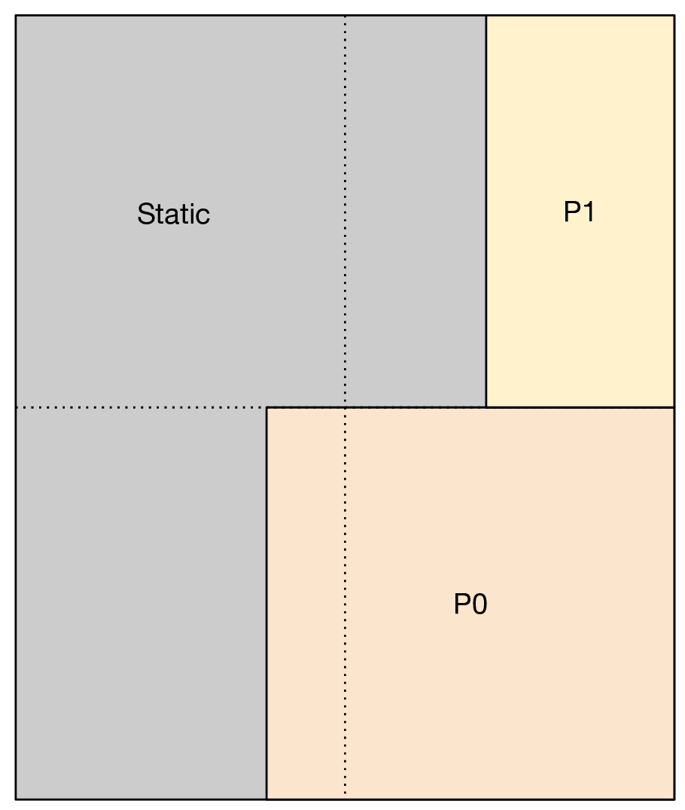

Video Processing with ZYBO Board
----------------------------------

This application has been designed to test the FRED runtime in a realistic scenario. The application makes use of the virtualized FPGA support to speed up the processing of live images acquired by a USB webcam and multiplications of integer matrices. The set of hardware image filters includes a Sobel filter, a FAST edge detection filter, and a color map filter. These filters have been implemented both as HLS hardware accelerators and equivalent software procedures using the popular OpenCV library with the purpose of testing the speedup factors.

In this application, the reconfigurable region is divided into two partitions containing a single slot each. These two slots are shared at runtime by four hardware accelerators (Sobel, FAST, Gmap, and Mult) using the FPGA virtualization mechanism offered by the FRED server.

The following video shows the case-study application operating in hardware mode. Please, note that the processing of each sub-image triggers a partial reconfiguration of the FPGA fabric, resulting in a rate higher than 50 reconfigurations per second. It is also worth noting that the FPGA contains resources to statically host only two of the four hardware accelerators and that a pure software implementation is considerably slower. Only by leveraging resource virtualization through partial reconfiguration all the four tasks can achieve a reasonable performance.

.. raw:: html

    

        <iframe src="https://www.youtube.com/embed/4k_w-Iwltok" frameborder="0" allowfullscreen style="position: absolute; top: 0; left: 0; width: 100%; height: 100%;"></iframe>
    

If you have a ZYBO board, you can try the case study application on your own. In addition to the board, you need a USB webcam capable of acquiring ``640x480`` frames, and a ``5V`` min ``2A`` capable power supply. To prepare the application, download the image file available `here <https://owncloud.retis.sssup.it/index.php/s/ht5S37gQFJbjQUe>`_. Then unzip the archive and copy the image to a micro SD of size ``2 GB`` or more using ``dd`` or an equivalent tool.

.. code:: bash

    $ unzip fred_cs.zip
    $ dd if=fred_sd.img of=/dev/mmcblk0 bs=8M conv=fsync

Once the micro SD is ready, insert it into the board, connect the external power supply, and remember to set the ZYBO for SD boot and external power supply using the board&rsquo;s jumpers. When ready, connect the USB webcam, an HDMI monitor, and then start the ZYBO. Once the boot process has completed, login usign ``root`` as username and password. Then, launch the FRED runtime and the Qt client application.

.. code:: bash

    $ ./start_fred.sh
    $ ./fredVideoApp -qws