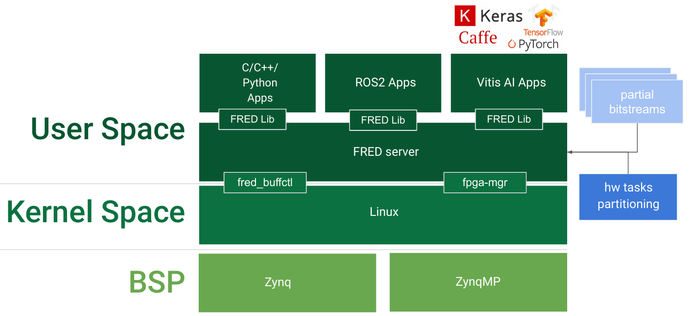

.. _intro:

===================
The FRED Framework
===================

FRED is a *framework* to support the design, development, and execution of *predictable software* on FPGA system-on-chips. It exploits *dynamic partial reconfiguration* and recurrent execution to *virtualize* the FPGA fabric, enabling the user to allocate a larger number of hardware accelerators than could otherwise be fit into the physical fabric. It integrates automated *floorplanning* and a set of *runtime mechanisms* to enhance *predictability* by scheduling hardware resources and regulating bus/memory contention.

The following set of tools and mechanisms are available:

- `DART <../dpr-design>`_: a floorplanner that optimizes the allocation of hardware accelerators on the FPGA fabric and generated optimized partial bitstreams for dynamic partial reconfiguration;

- `FRED runtime <../runtime>`_: a Linux support (exposed via both C and Python API) for managing hardware acceleration requests executing on a virtualized FPGA fabric with predictable response times.

- `FRED analizer <../analizer>`_: a schedulability analysis tool that verifies whether a set of real-time tasks and hardware accelerators can be executed within their timing constraints, taking into account all the sources of delays introduced by the architecture.

- `Predictable bus manager <../bus-manager>`_: a bus control unit that allows achieving predictable arbitration, protection from timing attacks, and bandwidth isolation to shield the system from misbehaving accelerators. This block is acompained by an automatic synthesis tool that optimizes the interconnect hierarchy to match timing constraints. This work is still *not fully integrated*. Please see the `Reseach Roadmap <../roadmap>`_.

Programming model
-----------------

The FRED framework targets system-on-chips that include both general-purpose processors and an FPGA fabric, sharing a common memory.
The framework manages two kinds of computational activities:

- *software tasks* (SW-tasks), which are computational activities running on the processors; and
- *hardware tasks* (HW-tasks), which are hardware accelerators that can be programmed to execute on the FPGA fabric.

The interaction between SW-tasks and HW-tasks is illustrated in the above figure. SW-tasks can request the execution of HW-tasks to accelerate specific computations. These acceleration requests are managed by the FRED framework to ensure that they are served with a predictable and bounded delay. A shared-memory communication paradigm with blocking synchronization is employed between SW-tasks and HW-tasks. Before requesting an acceleration, a SW-task must fill a buffer with the input data to be processed by the HW-task. The execution of the SW-task is then suspended when the acceleration request is issued. Once the corresponding HW-task will be programmed on the FPGA, it will autonomously access the shared memory to (*i*) retrieve the input data and (*ii*) store the output data it produces. Finally, once the acceleration request is completed, the SW-task is resumed and can access the output data produced by the HW-task in the shared memory.

SW-tasks are scheduled by the operating system that controls the processors. To ensure predictability in scheduling SW-tasks, FRED mandates the use of partitioned fixed-priority scheduling (each SW-task is statically allocated to a processor and assigned of a static priority).

Conversely, the acceleration requests are directly managed by the `FRED runtime <../runtime>`_ with a custom scheduling policy.

FRED software stack
----------------------
.. comments 
    this image source can be found in this link 
    https://docs.google.com/presentation/d/10wZZSQadBjDf3sg9Mvy9TM_6Sgrb7MYRacJHg6nL2AY/edit?usp=sharing

The figure above illustrates the FRED software stack and is used to introduces its main components. At the **application level** we see that it possible to write applications with `C/C++/Python programming languages <https://github.com/fred-framework/fred-tutorial-app>`_. It is also possible to write applications using ROS2 and Xilinx Vitis AI frameworks (*both currently under development*). Still in **user space**, we have the `fred_lib <https://github.com/fred-framework/fred-linux-client-lib>`_ which is linked with the application to have access to the `fred_server <https://github.com/fred-framework/fred-linux>`_. In kernel space, two Linux kernel modules, called `fred_buffctl <>`_ and `fpga_mgr <>`_, where developed/modified to abstract the access to the FPGA fabric. 

Three auxiliar repositories were develop to ease the runtime part of FRED framework:

- `fred-framework <https://github.com/fred-framework/fred-framework>`_: a meta repository that combines all the software parts presented above, facilitating compilation in the board;
- `meta-fred <https://github.com/fred-framework/meta-fred>`_: A Yocto layer to facilitate cross-compilation and integration with a Linux image;
- `meta-retis <https://github.com/fred-framework/meta-retis>`_: A pre-configured Yocto image running on top of Xilinx petalinux that includes several resources for embedded software development for soft realtime applications. This image can be combined with *meta-fred* to generate a complete FRED-enabled Linux image for both **Zynq** and **ZynqMP** FPGA boards.

Predictable DPR design
-----------------------

As can be seen in the FRED software stack figure, the FRED server expects partial bitstreams and the HW-task partitions as inputs. These inputs are generated in design time by `DART <../dpr-design>`_, which main steps is illustrated in the next figure.

.. comments 
    this image source can be found in this link 
    https://docs.google.com/presentation/d/10wZZSQadBjDf3sg9Mvy9TM_6Sgrb7MYRacJHg6nL2AY/edit?usp=sharing

.. image:: ../images/dart-design-flow.png
    :width: 400px
    :align: center
    :alt: DART design flow

DART main input is a set of IP cores that will be synthesized for partial bitstreams. This set of IPs represent the FPGA offload logic represented by the SW-tasks. The repository `dart_ips <https://github.com/fred-framework/dart_ips>`_ presents a set of IPs ready to be used by DART. 

DART currently supports the following FPGA boards:

- `Pynq board <https://store.digilentinc.com/pynq-z1-python-productivity-for-zynq-7000-arm-fpga-soc/>`_: with device XC7Z020-1CLG400C;
- `Zybo board <https://reference.digilentinc.com/programmable-logic/zybo/start>`_: with the device XC7Z010-1CLG400C; 
- `ZCU102 board <https://www.xilinx.com/products/boards-and-kits/ek-u1-zcu102-g.html>`_: with Zynq UltraScale+ XCZU9EG-2FFVB1156 MPSoC;
- `Ultra96v2 board <https://www.avnet.com/wps/portal/us/products/new-product-introductions/npi/aes-ultra96-v2/>`_;

DART is currently integrated with Xilinx Vivado for FPGA synthesis. The `DART repository <>`_ provides its source code, documentation and additional examples.
