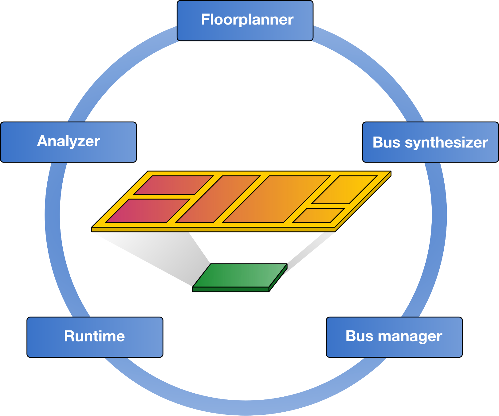

=========
FRED Docs
=========

FRED is a framework to support the design, development, and execution of *predictable* software on FPGA system-on-chips platforms.

It exploits **dynamic partial reconfiguration** and recurrent execution to virtualize the FPGA fabric, enabling the user to allocate a larger number of hardware accelerators than could otherwise be fit into the physical fabric. It integrates *automated floorplanning* and a set of *runtime mechanisms* to enhance predictability by scheduling hardware resources and regulating bus/memory contention.

.. comment
    figure are like images but with a caption

.. _fred_framework_fig:

    FRED workflow

The :ref:`fred_framework_fig` figure shows the 5 pillars of FRED framework: floorplanner, bus synthesis, bus manager, runtime, and the analyzer. As presented next, the current focus is on the automatic floorplanner and FRED runtime. The other items are to be included into the framework in the future.

The project is in developed at the `Real-Time Systems Laboratory (RETIS Lab) <https://retis.santannapisa.it/>`_ of the `Scuola Superiore Sant’Anna <https://www.santannapisa.it/en>`_ of Pisa.

Table of Contents
------------------

This document is organized as folloes. First it presents and introduction of the framework. The five next sections describes the five parts presented in the :ref:`fred_framework_fig` figure. Next there is the gettig started section which guides through the framework instalation and setup. The next section presents some case studies, research roadmap, complete list of publications, and additional project-related information.

.. toctree::
   :maxdepth: 2
   
   
   docs/01_intro/index
   docs/02_dart/index
   docs/03_runtime/index   
   docs/04_analyzer/index
   docs/05_bus-manager/index
   docs/06_bus-syn/index
   docs/07_getting-started/index
   docs/08_case-studies/index
   docs/09_roadmap/index
   docs/10_publications/index
   docs/11_about/index

Papers
------

If you are using FRED and/or its software on your research projects, please cite our papers:
	
.. code-block:: none

    @inproceedings{biondi2016framework,
    title={A framework for supporting real-time applications on dynamic reconfigurable FPGAs},
    author={Biondi, Alessandro and Balsini, Alessio and Pagani, Marco and Rossi, Enrico and Marinoni, Mauro and Buttazzo, Giorgio},
    booktitle={IEEE Real-Time Systems Symposium (RTSS)},
    pages={1--12},
    year={2016},
    organization={IEEE}
    }

.. code-block:: none

    @article{fred-linux,
    title = {A Linux-based support for developing real-time applications on heterogeneous platforms with dynamic FPGA reconfiguration},
    journal = {Future Generation Computer Systems},
    volume = {129},
    pages = {125-140},
    year = {2022},
    issn = {0167-739X},
    doi = {https://doi.org/10.1016/j.future.2021.11.007},
    url = {https://www.sciencedirect.com/science/article/pii/S0167739X21004362},
    author = {Marco Pagani and Alessandro Biondi and Mauro Marinoni and Lorenzo Molinari and Giuseppe Lipari and Giorgio Buttazzo},
    keywords = {Heterogeneous computing, FPGA, DPR, Real-time, Linux}
    }

If you are using DART, please cite:

.. code-block:: none

    @inproceedings{seyoum2021automating,
    title={Automating the design flow under dynamic partial reconfiguration for hardware-software co-design in FPGA SoC},
    author={Seyoum, Biruk and Pagani, Marco and Biondi, Alessandro and Buttazzo, Giorgio},
    booktitle={ACM Symposium on Applied Computing (SAC)},
    pages={481--490},
    year={2021}
    }

License
--------

FRED/DART and its software are protected under the GPLv3_ license.

.. _GPLv3: https://opensource.org/licenses/GPL-3.0

Feedback
--------

Don't hesitate to ask about additional info or the next guides, and also if you find some mistakes, please let us know. Issues and push requests can be done on github_.

.. _github: http://github.com/fred-framework

